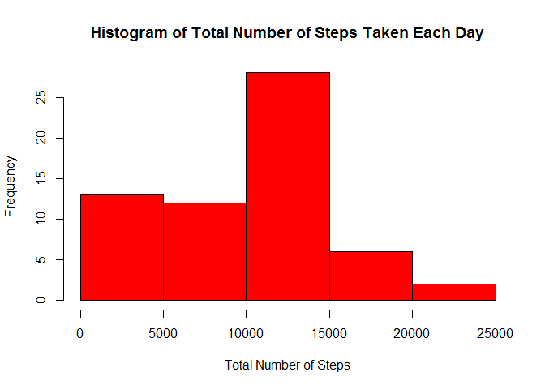
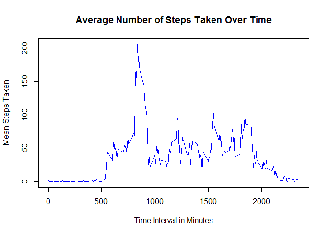
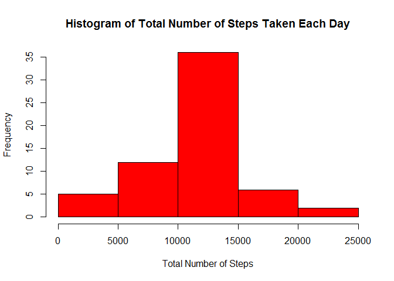
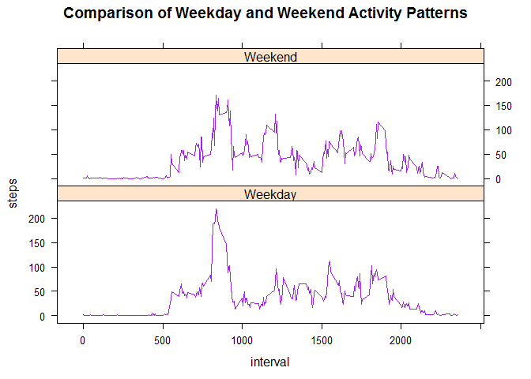

# Reproducible Research Assignment 1
Patti Morsillo  
October 19, 2016  
##Introduction

It is now possible to collect a large amount of data about personal movement using activity monitoring devices such as a [Fitbit](http://www.fitbit.com/), [Nike](http://www.nike.com/us/en_us/c/nikeplus-fuelband), [Fuelband](http://www.nike.com/us/en_us/c/nikeplus-fuelband), or [Jawbone Up](https://jawbone.com/up). These type of devices are part of the "quantified self" movement - a group of enthusiasts who take measurements about themselves regularly to improve their health, to find patterns in their behavior, or because they are tech geeks. But these data remain under-utilized both because the raw data are hard to obtain and there is a lack of statistical methods and software for processing and interpreting the data.

This assignment makes use of data from a personal activity monitoring device. This device collects data at 5 minute intervals through out the day. The data consists of two months of data from an anonymous individual collected during the months of October and November, 2012 and include the number of steps taken in 5 minute intervals each day.

The data for this assignment can be downloaded from the course web site:
 
Dataset: [Activity monitoring data](https://d396qusza40orc.cloudfront.net/repdata%2Fdata%2Factivity.zip) [52K]

The variables included in this dataset are:

* steps: Number of steps taking in a 5-minute interval (missing values are coded as <span style="color:red">NA</span>)
* date: The date on which the measurement was taken in YYYY-MM-DD format
* interval: Identifier for the 5-minute interval in which measurement was taken

The dataset is stored in a comma-separated-value (CSV) file and there are a total of 17,568 observations in this dataset.

##Assignment

This assignment will be described in multiple parts. You will need to write a report that answers the questions detailed below. Ultimately, you will need to complete the entire assignment in a **single R markdown** document that can be processed by **knitr** and be transformed into an HTML file.

Throughout your report make sure you always include the code that you used to generate the output you present. When writing code chunks in the R markdown document, always use <span style="color:red">echo = TRUE</span> so that someone else will be able to read the code. **This assignment will be evaluated via peer assessment so it is essential that your peer evaluators be able to review the code for your analysis.**

For the plotting aspects of this assignment, feel free to use any plotting system in R (i.e., base, lattice, ggplot2)

Fork/clone the [GitHub repository created for this assignment](http://github.com/rdpeng/RepData_PeerAssessment1). You will submit this assignment by pushing your completed files into your forked repository on GitHub. The assignment submission will consist of the URL to your GitHub repository and the SHA-1 commit ID for your repository state.

NOTE: The GitHub repository also contains the dataset for the assignment so you do not have to download the data separately.

**Loading and preprocessing the data**

Show any code that is needed to

1. Load the data (i.e. <span style="color:red">read.csv()</span>)


```r
## First, check if the /data directory exists.  If it does not, create one.
if (!dir.exists("./data")) {  
          dir.create("./data")  
}  
## Next, check to see if the activity.csv file already exists.  If not, download the file and unzip it.
if (!file.exists("./data/activity.csv")) {  
          fileUrl<-"https://d396qusza40orc.cloudfront.net/repdata%2Fdata%2Factivity.zip"  
          download.file(fileUrl, destfile="./repdata_data_activity.zip")  
          unzip(zipfile="./repdata_data_activity.zip", exdir="./data")            
}  
## read the file and store it in a data frame named "activity"
activity<-read.csv("data/activity.csv", colClasses=c("numeric", "Date", "numeric"))  
```

2. Process/transform the data (if necessary) into a format suitable for your analysis


```r
activity$date<-as.POSIXct(activity$date, format="%Y-%m-%d")
```


**What is mean total number of steps taken per day?**

For this part of the assignment, you can ignore the missing values in the dataset.

1. Calculate the total number of steps taken per day


```r
## use tapply to sum the steps column data by date
##totActivity<-aggregate(steps~date, data=activity, sum, na.rm=TRUE)
totActivity<-tapply(activity$steps, activity$date, sum, na.rm=TRUE)
head(totActivity)
```

```
## 2012-09-30 20:00:00 2012-10-01 20:00:00 2012-10-02 20:00:00 
##                   0                 126               11352 
## 2012-10-03 20:00:00 2012-10-04 20:00:00 2012-10-05 20:00:00 
##               12116               13294               15420
```

2. If you do not understand the difference between a histogram and a barplot, research the difference between them. Make a histogram of the total number of steps taken each day


```r
## create a histogram of the total number of steps per day
hist(totActivity, 
     col="red", 
     xlab="Total Number of Steps", 
     main="Histogram of Total Number of Steps Taken Each Day")
```

<!-- -->

3. Calculate and report the **mean** and **median** of the total number of steps taken per day


```r
## use the mean and median functions on totActivity  
myMean<-formatC(mean(totActivity), format="f", digits=0)  
myMedian<-formatC(median(totActivity), format="f", digits=0)  
```

The Mean of the total number of steps taken per day is **9354** .      
The Median of the total number of steps taken per day is **10395** .    

**What is the average daily activity pattern?**

1. Make a time series plot (i.e. <span style="color:red">type = "l"</span>) of the 5-minute interval (x-axis) and the average number of steps taken, averaged across all days (y-axis)


```r
aggData<-setNames(aggregate(steps~interval, data=activity, FUN=mean, na.rm=TRUE), c("interval", "mean"))
head(aggData)
```

```
##   interval      mean
## 1        0 1.7169811
## 2        5 0.3396226
## 3       10 0.1320755
## 4       15 0.1509434
## 5       20 0.0754717
## 6       25 2.0943396
```

```r
plot(aggData$interval, 
     aggData$mean, 
     type="l", 
     col="blue", 
     xlab="Time Interval in Minutes", 
     ylab="Mean Steps Taken", 
     main="Average Number of Steps Taken Over Time")
```

<!-- -->

2. Which 5-minute interval, on average across all the days in the dataset, contains the maximum number of steps?


```r
maxPosition<-which(aggData$mean == max(aggData$mean))
maxData<-aggData[maxPosition,1]
```

The 5-minute interval that contains the maximum number of steps, on average across all the days is **835**


**Imputing missing values**

Note that there are a number of days/intervals where there are missing values (coded as <span style="color:red">NA</span>). The presence of missing days may introduce bias into some calculations or summaries of the data.

1. Calculate and report the total number of missing values in the dataset (i.e. the total number of rows with <span style="color:red">NAs</span>)


```r
## create a vector of indices into the activity data frame where the steps value equals NA
naPos<-which(is.na(activity$steps))
naTot<-length(naPos)
```

The dataset contains **2304** missing values.


2. Devise a strategy for filling in all of the missing values in the dataset. The strategy does not need to be sophisticated. For example, you could use the mean/median for that day, or the mean for that 5-minute interval, etc.


```r
## my method for filling missing values will be to find the mean per interval across the data, and use this mean to 
## fill in the missing value for that interval.
meanInterval<-aggregate(steps~interval, data=activity, FUN=mean, na.rm=TRUE)
```

3. Create a new dataset that is equal to the original dataset but with the missing data filled in.

```r
## loop through each index in naPos, and replace the NA value for that entry in the activity data frame with the mean 
## step value for that interval, which was stored in meanInterval
for(i in 1:naTot){
          activity[naPos[i], "steps"]<-
                    meanInterval[which(meanInterval$interval == activity[naPos[i],"interval"]), "steps"]
}
naTot<-length(which(is.na(activity$steps)))
```

Now, there are **0** missing values.


4. Make a histogram of the total number of steps taken each day and Calculate and report the mean and median total number of steps taken per day. Do these values differ from the estimates from the first part of the assignment? What is the impact of imputing missing data on the estimates of the total daily number of steps?


```r
## recalculate the steps per day
totActivity<-tapply(activity$steps, activity$date, sum)
head(totActivity)
```

```
## 2012-09-30 20:00:00 2012-10-01 20:00:00 2012-10-02 20:00:00 
##            10766.19              126.00            11352.00 
## 2012-10-03 20:00:00 2012-10-04 20:00:00 2012-10-05 20:00:00 
##            12116.00            13294.00            15420.00
```

```r
## next, create a histogram of the steps per day
hist(totActivity, 
     col="red", 
     xlab="Total Number of Steps", 
     main="Histogram of Total Number of Steps Taken Each Day")
```

<!-- -->

```r
## now recalculate the mean and median
myNewMean<-formatC(mean(totActivity, na.rm=TRUE), format="f", digits=0)
myNewMedian<-formatC(median(totActivity, na.rm=TRUE), format="f", digits=0)
```


The Mean of the total number of steps taken per day after imputing the missing values is **10766** .      
The Median of the total number of steps taken per day after imputing the missing values is **10766** . 
By imputing the missing values, we have added more data points to the collection, which will increase both the mean and the median of the data set.  In this case, the mean has increased from **'r myMean'** to **'r myNewMean'**, and the median has increased from **'r myMedian'** to **'r myNewMedian**.

**Are there differences in activity patterns between weekdays and weekends?**

For this part the <span style="color:red">weekdays()</span> function may be of some help here. Use the dataset with the filled-in missing values for this part.

1. Create a new factor variable in the dataset with two levels - "weekday" and "weekend" indicating whether a given date is a weekday or weekend day.


```r
## first, determine the day of the week from the date field
activity$dayofweek<-weekdays(activity$date)
## next, set the day type field as Weekday or Weekend
activity$daytype<-ifelse(activity$dayofweek %in% c("Monday", "Tuesday", "Wednesday", "Thursday", "Friday"), c("Weekday"), c("Weekend"))
## factor on weekday or weekend
activity$daytype<-as.factor(activity$daytype)
str(activity)
```

```
## 'data.frame':	17568 obs. of  5 variables:
##  $ steps    : num  1.717 0.3396 0.1321 0.1509 0.0755 ...
##  $ date     : POSIXct, format: "2012-09-30 20:00:00" "2012-09-30 20:00:00" ...
##  $ interval : num  0 5 10 15 20 25 30 35 40 45 ...
##  $ dayofweek: chr  "Sunday" "Sunday" "Sunday" "Sunday" ...
##  $ daytype  : Factor w/ 2 levels "Weekday","Weekend": 2 2 2 2 2 2 2 2 2 2 ...
```


2. Make a panel plot containing a time series plot (i.e. <span style="color:red">type = "l"</span>) of the 5-minute interval (x-axis) and the average number of steps taken, averaged across all weekday days or weekend days (y-axis). See the README file in the GitHub repository to see an example of what this plot should look like using simulated data.


```r
library(lattice)
actPattern<-aggregate(steps~interval+daytype, data=activity, FUN=mean)
xyplot(steps~interval|daytype, data=actPattern, layout=c(1,2), type="l", main="Comparison of Weekday and Weekend Activity Patterns", col="purple")
```

<!-- -->

